# Projeto de pós-graduação - Arquitetura de Software Distribuído - Puc Minas

O objetivo deste projeto é apresentar o projeto de conclusão do curso de **Arquitetura de Software Distribuído**.

- [Etapa 01](#etapa-01)
- [Etapa 02](#etapa-02)
- [Etapa 03](#etapa-03)

## **Etapa 1** [Módulo A - Data de Entrega A4 - 15/08/2022](https://pucminas.instructure.com/courses/64585/assignments/505763)

> Todos os aquivos referentes a esta etapa estao no diretorio [etapa-01/](./etapa-01/)

- Apresentação adequada do texto :memo: [DOCX](./etapa-01/projeto-integrado-aisoftware-tracker.docx) | :page_facing_up: [PDF](./etapa-01/projeto-integrado-aisoftware-tracker.pdf)
- Contextualização e problema :memo: [DOCX](./etapa-01/projeto-integrado-aisoftware-tracker.docx) | :page_facing_up: [PDF](./etapa-01/projeto-integrado-aisoftware-tracker.pdf)
- Objetivos :memo: [DOCX](./etapa-01/projeto-integrado-aisoftware-tracker.docx) | :page_facing_up: [PDF](./etapa-01/projeto-integrado-aisoftware-tracker.pdf)
- [Restrições arquiteturais](#restricoes-arquiteturais)
- [Requisitos funcionais](#requisitos-funcionais)
- [Requisitos não funcionais](#requisitos-nao-funcionais)
- [Mecanismos arquiteturais](#mecanismos-arquiteturais)
- [Diagrama de contexto](#diagrama-contexto)
- [Vídeo com apresentação](#video-etapa-01)
- Apresentação [PPTX](./etapa-01/projeto-integrado-aisoftware-tracker.pptx)

### Restrições Arquiteturais
- [RA01] - Deve ser usado tecnologias abertas (Open source) para o desenvolvimento de toda a plataforma.
- [RA02] - Deve ser usado o serviço de nuvem da Heroku como provedora da infraestrutura necessária para a plataforma.
- [RA03] - Deve ser usado o serviço oAuth0 JWT para autenticação, com a possibilidade inicial de criação de conta diretamente na plataforma por outro usuário que tenha acesso de ADM.
- [RA04] - Deve-se utilizar uma api de um terceiro, Trackmax, para ter as informações de geolocalização e informções da frota

### Requisitos Funcionais
- [RF01] - Manter Usuários
- [RF02] - Manter Motoristas
- [RF03] - Manter Dispositivos (Veículos)
- [RF04] - Manter Grupos (Clientes)
- [RF05] - Consultar posicionamento de todos os dispositivos no Mapa por latitude e longitude
- [RF05] - Exibir veículos no mapa
- [RF05] - Exibir rota de veículo no mapa
- [RF05] - Exibir lista de veículos com informações basicas, posicionamento e último endereço de posicionamento.
- [RF06] - Consultar e Exportar Relatórios de Rotas 
- [RF07] - Consultar e Exportar Relatórios de Eventos 
- [RF08] - Consultar e Exportar Relatórios de Resumo 

### Requisitos Não Funcionais
- [RNF01] - A plataforma deve habilitar a autenticação baseado no modelo JWT diretamente no sistema.
- [RNF02] - O sistema deve ser responsivo web.
- [RNF03] - O sistema deve ser responsivo para todos os tipos de tela (Computadores, Notebooks, Tablets e Smartphones).
- [RNF04] - O sistema deverá utilizar uma API de terceiro para realizar as persistências de informações dos dispositivos rastreadores.
- [RNF05] - O sistema deve operar 24x7.
- [RNF06] - Apenas usuários com permissão de Admin, tem permissão de criar e editar dados do sistema
- [RNF07] - Usuários operacionais, podem apenas acessar dados de leitura.

### Mecanismos Arquiteturais

Análise	| Design | Implementação
-----   |-----   |-----   |
Persistência | Micro ORM | Dapper
Persistência | Banco de Relacional | Postgres
Front end | Interface de comunicação com o usuário do painel | ASP.NET, Razor, html5, javascript, css
Front end | Navegador Web | Mozilla Firefox / Google Chrome
Teste de Software | Testes Unitários | XUnit
Autenticação | OAuth0 JWT | Microsoft.AspNetCore.Authentication.JwtBearer
Tratamento de exceções | Camada para tratar as exceções criando interações diferentes para usuários e técnicos | ASP.NET e C# 
Build | Linha de comando | Terminal utilizando CLI ASP.NET
Build | Via Pipeline | Heroku pipeline 
Deploy | Pipeline | Heroku / Github 

### Diagrama de Contexto

[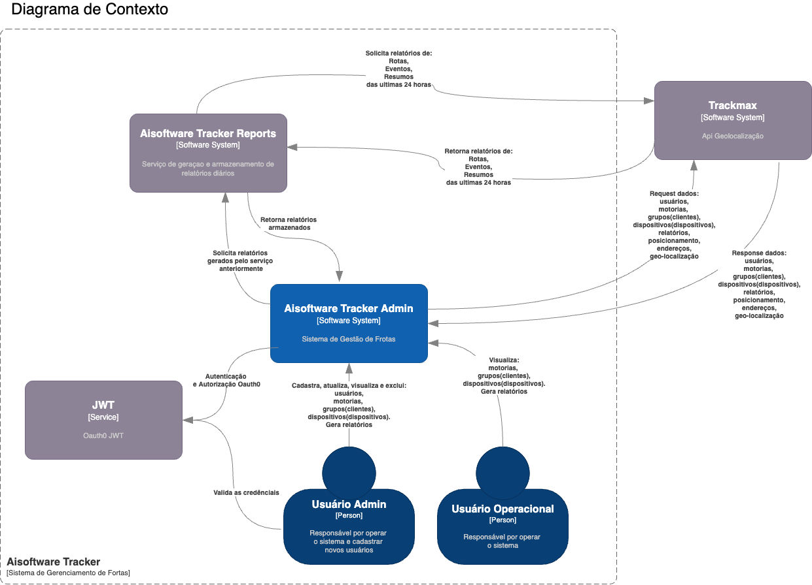](./etapa-01/img/diagrama-contexto.drawio.png)

[ Diagrama de contexto drawio](./etapa-01/diagrama-contexto.drawio)

### Vídeo com apresentação

[ Vídeo com apresentação da Etapa 01](https://youtu.be/Kt1YkLTPLBg)

### Referências
> LOCALIZA. **Evolução da frota de veículos no Brasil.** 
> Disponível em: https://frotas.localiza.com/blog/frota-de-veiculo. 
> Acesso em: 10 de agosto de 2022.

> IBGE. **Frota de Veículos.**  
> Disponível em: https://cidades.ibge.gov.br/brasil/pesquisa/22/28120?indicador=28122&tipo=grafico. 
> Acesso em: 10 de agosto de 2022.

> UNISEPE. **O transporte rodoviário movimentando o Brasil.**  
> Disponível em: https://portal.unisepe.com.br/blog-unisepe/ o-transporte-rodoviario-movimentando-o-brasil/. 
> Acesso em: 10 de agosto de 2022.

> SUSEP. **IVR - Índice de veículos roubados.** 
> Disponível em: http://www2.susep.gov.br/menuestatistica/RankRoubo/resp_menu1.asp.  
> Acesso em: 10 de agosto de 2022.

> MINISTÉRIO DA INFRAESTRUTURA. **Frota de veículos - 2021.**  
> Disponível em: https://www.gov.br/infraestrutura/pt-br/assuntos/transito/conteudo-Senatran/frota-de-veiculos-2021.  
> Acesso em: 10 de agosto de 2022.

## **Etapa 2** [Módulo B - Data de Entrega B4 - 15/10/2022](https://pucminas.instructure.com/courses/64585/assignments/505764)

> Todos os aquivos referentes a esta etapa estao no diretorio [etapa-02/](./etapa-02/)

- [Diagrama de container](#diagrama-container)
- [Diagrama de componentes](#diagrama-componentes)
- [Wireframe de telas](#wireframe-telas)
- [Código da aplicação](#codigo-aplicacao)
- Documentação do Projeto :memo: [DOCX](./etapa-02/projeto-integrado-aisoftware-tracker.docx) | :page_facing_up: [PDF](./etapa-02/projeto-integrado-aisoftware-tracker.pdf)

 
### Diagrama de container
[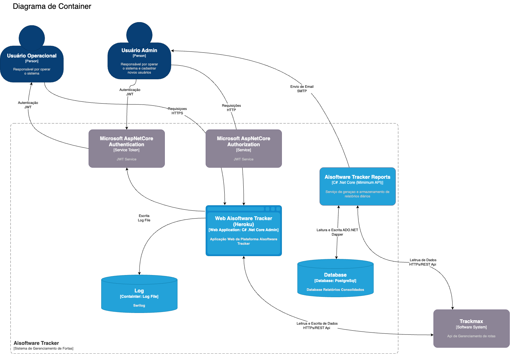](./etapa-02/img/diagramas-container.drawio.png)

[ Diagrama de container drawio](./etapa-02/diagramas.drawio)

### Diagrama de componentes
[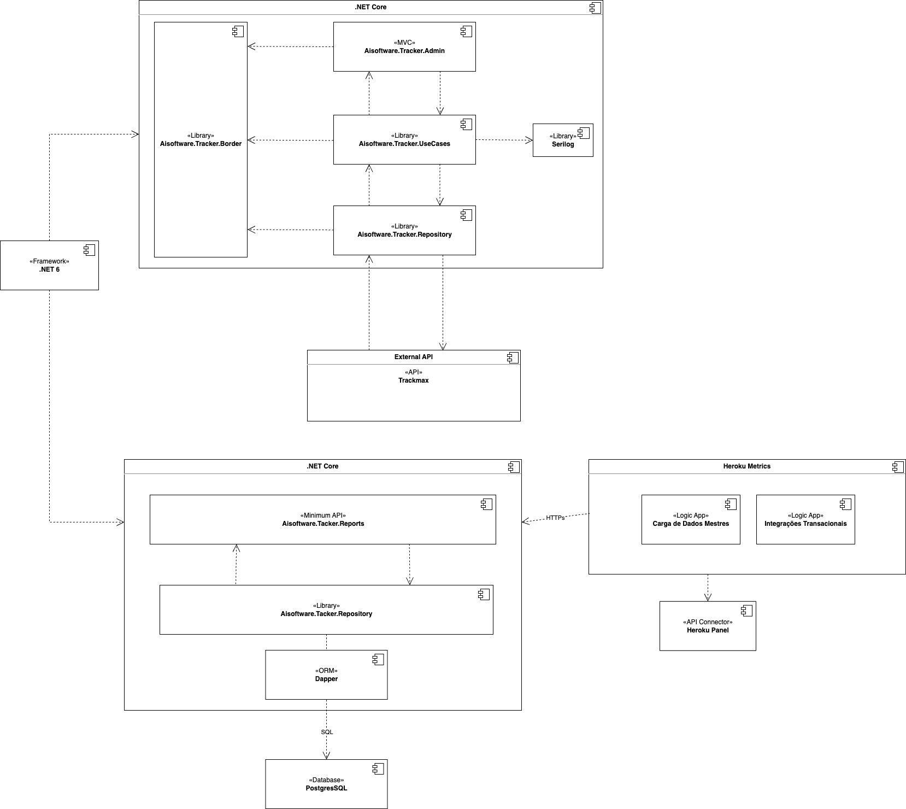](./etapa-02/img/diagramas-componentes.drawio.png)

[ Diagrama de componentes drawio](./etapa-02/diagramas.drawio)

### Wireframe de telas

- [Wireframe de telas](https://miro.com/app/board/uXjVPeGQ-7Y=/?share_link_id=352327279950)

 

### Código da aplicação
[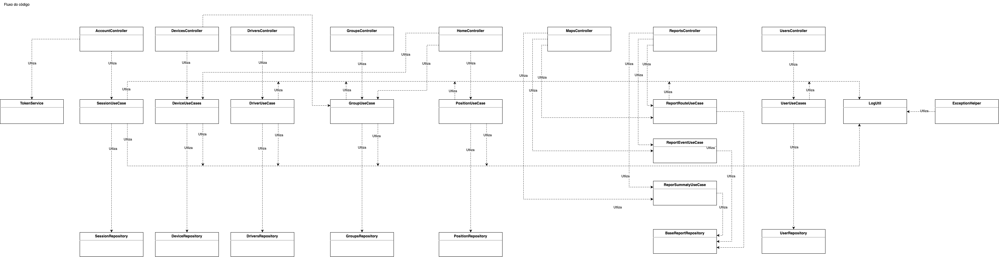](./etapa-02/img/diagramas-codigo-aplicacao.drawio.png)
- [Repo Aisoftware.Tracker.Admin](https://github.com/igoraujo/aisoftware-tracker-admin)
- [POC Publicada](https://aisoftware-tracker-admin.herokuapp.com/)
- [UML do Banco de Dados](./etapa-02/img/database-reports-uml.png)
- [Script do Banco de Dados](./etapa-02/report.sql)

## **Etapa 3** [Módulo C - Data de Entrega C4 - 15/12/2022](https://pucminas.instructure.com/courses/64585/assignments/505766)

> Todos os aquivos referentes a esta etapa estao no diretorio [etapa-03/](./etapa-03/)

- [Análise das abordagens arquiteturais](#análise-abordagens-arquiteturais)
- [Cenários](#cenarios)
- [Evidências da avaliação](#evidencias-avaliacao)
- [Resultados obtidos](#resultados-obtidos)
- [Avaliação crítica dos resultados](#avaliacao-critica-resultados)
- [Conclusão](#conclusao)
- [Vídeo de apresentação final](#video-etapa-03)
- [PPTX](etapa-03/projeto-integrado-final-aisoftware-tracker.pptx), :memo: [DOC](etapa-03/projeto-integrado-aisoftware-tracker.docx), :page_facing_up: [PDF](etapa-03/projeto-integrado-aisoftware-tracker.pdf)

### Análise das abordagens arquiteturais

Atributos de Qualidade | Cenários | Importância | Complexidade
--------------------   |-------   |----------   |-----------  |
Disponibilidade        | Cenário 1: O sistema deve estar disponível 7/7, com enfase no horário comercial.   | A   | M
Usabilidade  | Cenário 2: O sistema deve prover boa usabilidade e compatibilidade browsers distintos.  | M  | B
Usabilidade   | Cenário 3: O sistema deve possuir responsividade em sua interface de usuário.   | M   | B
Desempenho   | Cenário 4: O tempo de resposta das requisições deve ser inferior a 2 segundos em 90% do tempo.   | M   | M
Desempenho   | Cenário 5: O sistema deve suportar picos de tráfego com escalonamento automático.   | A   | A  |
Segurança   | Cenário 6: O sistema deve exigir autenticação para navegar no mesmo e autorização para acessar determinados tipos de acessos restritos a diferentes perfis.  | A  | M  |

### Cenários
  * Cenário 1 - Disponibilidade: Ao acessar o sistema durante qualquer horário do dia em qualquer dia da semana, deve ser possível logar e utilizar dos recursos do sistema, principalmente gerar relatórios e consultar o mapa. O ideal é que o sistema sempre esteja disponível, podendo ficar no máximo 48hs anuais indisponível.
  * Cenário 2 - Usabilidade: A navegação pela interface do sistema deve ser simples e intuitiva, com nomes e ícones de fácil percepção para ajudar no entendimento da navegação independente do browser utilizado: Google Chrome, Mozila Firefox, Microsoft Edge, entre outros.
  * Cenário 3 – Usabilidade: Ao navegar pela interface utilizando um navegador móvel, deve ser possível executar todas as funções do sistema, de maneira responsíva. 
  * Cenário 4 – Desempenho: O tempo de resposta da operação de cadastro de iniciativas de distribuição deve ser igual ou inferior ao tempo normal de 2 segundos, para as atividades normais. Podendo ter este tempo extendido ao gerar relatórios com grande volume de dados. 
  * Cenário 5 – Desempenho: O Sistema deve suportar picos de acesso, escalando automaticamente e alocando mais Dynos (Pods) caso necessário.
  * Cenário 6 – Segurança: O sistema deve exigir autenticação para acessar o mesmo e sua navegação é baseade em autorização de acesso, de acordo com privilégios do perfil.
 

### Evidências da avaliação

#### Cenário 1

| **Atributo de Qualidade:**  | Confiabilidade             |
| --------------------------- | ------------------------------------------------------------ |
| **Requisito de Qualidade:** | O sistema deve estar disponível 7/7 em qualquer hora do dia. |
| **Preocupação:** | Garantir que o sistema esteja disponível principalmente durante o horário comercial e, que seus respectivos relatórios estejam sendo gerados conforme o esperado. |
| **Cenários(s):** | Cenário 1 |
| **Ambiente:** | Sistema em operação normal |
| **Estímulo:** | Acesso ao sistema 7/7, porém, principalmente nos dias de semana e em horário comercial. |
| **Mecanismo:** | Utilização normal do sistema e monitoramento através do Heroku Metrics e Arquivos de Log. |
| **Medida de Resposta:** | Utilização dos alarmes do Heroku Metrics.   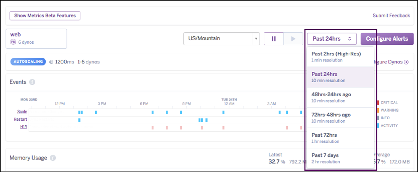 |
| **Consideração sobre a arquitetura:** |  |
| **Riscos:** | Alguma instabilidade ou indisponibilidade de um fornecedor terceiro pode interferir no tempo de resposta ou disponibillidade de recursos da aplicação. |
| **Pontos de Sensibilidade:** | Utilização de API de terceiro para alguns recursos. |
| **Tradeoff:** | Custo de internalizar os recursos que a API do terceiro fornece. |

#### Cenário 2

| **Atributo de Qualidade:**  | Confiabilidade             |
| --------------------------- | ------------------------------------------------------------ |
| **Requisito de Qualidade:** | O sistema web deve ser compatível com os principais browsers do mercado atual. |
| **Preocupação:** | O sistema deve prover boa usabilidade e compatibilidade browsers distintos. |
| **Cenários(s):** | Cenário 2 |
| **Ambiente:** | Sistema em operação normal |
| **Estímulo:** | Acesso a URL principal da aplicação |
| **Mecanismo:** | Utilização de ferramentas e recursos de front-end aceita pela maioria dos navegadores, assim como web-kits compatíveis com os mesmos. |
| **Medida de Resposta:** | As telas e componentes devem de ser de fácil abstração pelo usuário apresentando coesão entre as telas da aplicação.
Google Chome:

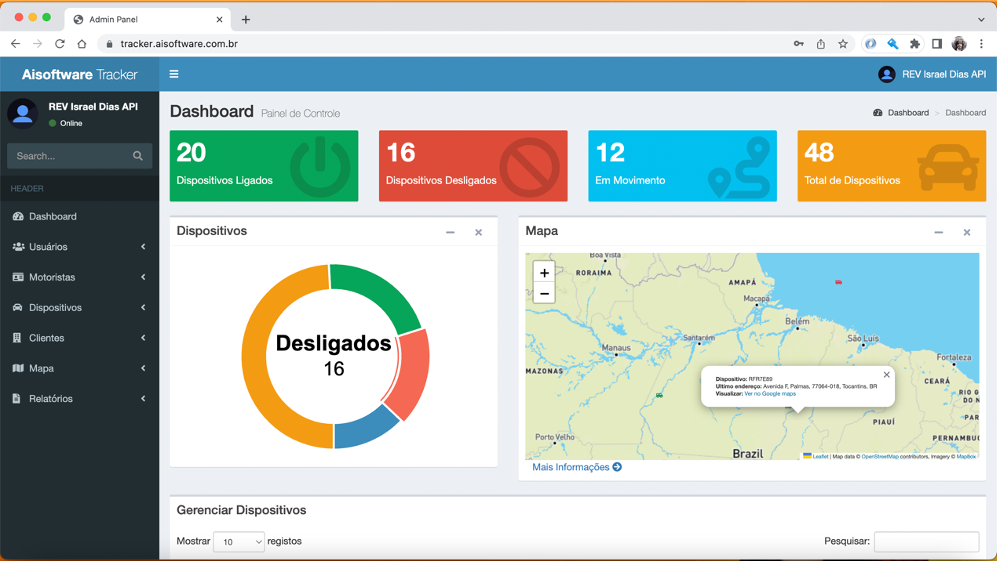 

Safari: 
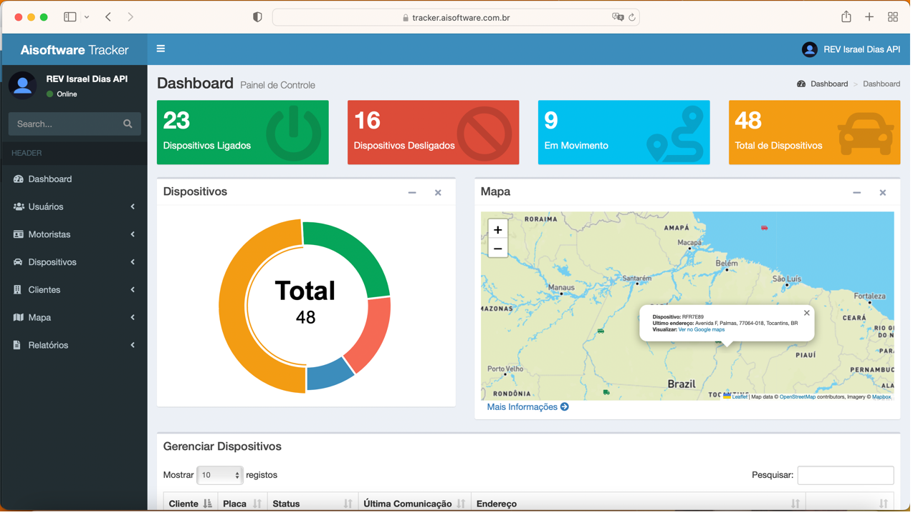 |
| **Consideração sobre a arquitetura:** |  |
| **Riscos:** | Alguns recursos podem apresentar comportamentos visuais distintos em navegadores muito antigos, por exemplo, o Internet Explorer. |
| **Pontos de Sensibilidade:** | Utilização de biblioteca de mapas de terceiros |
| **Tradeoff:** | N/A |

#### Cenário 3

| **Atributo de Qualidade:**  | Confiabilidade             |
| --------------------------- | ------------------------------------------------------------ |
| **Requisito de Qualidade:** | --------- |
| **Preocupação:** | --------- |
| **Cenários(s):** | Cenário 3 |
| **Ambiente:** | Sistema em operação normal |
| **Estímulo:** | Acesso a URL principal da aplicação |
| **Mecanismo:** | Utilização de bibliotecas, kits e técnicas de responsividade como, o Bootstrap, e estilização manual com CSS, e Javascript. |
| **Medida de Resposta:** | O layout do sistema deve se adaptar conforme o tipo de dispositivo utilizado para acesso.   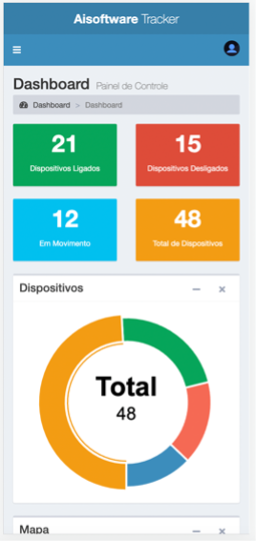
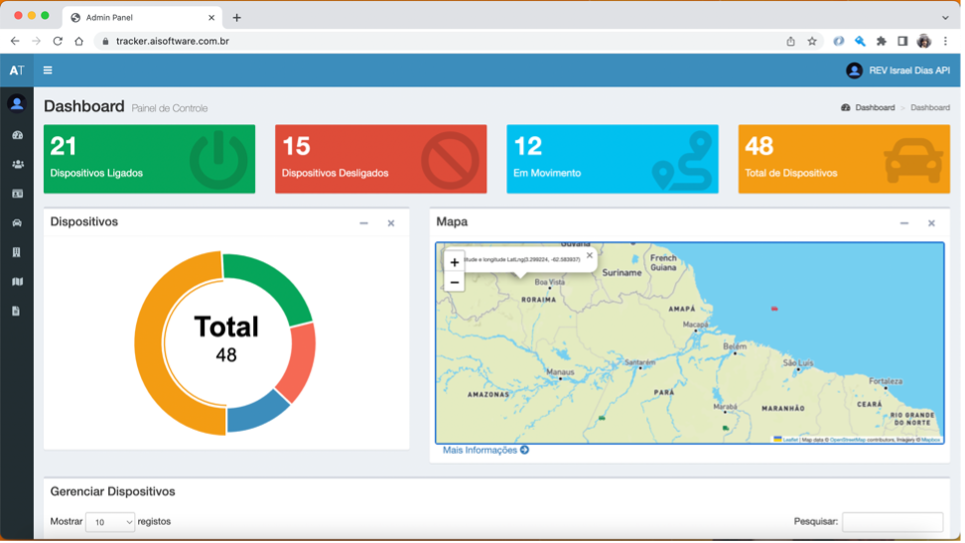
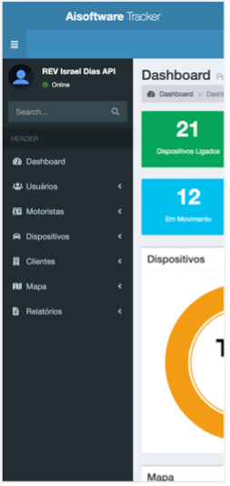

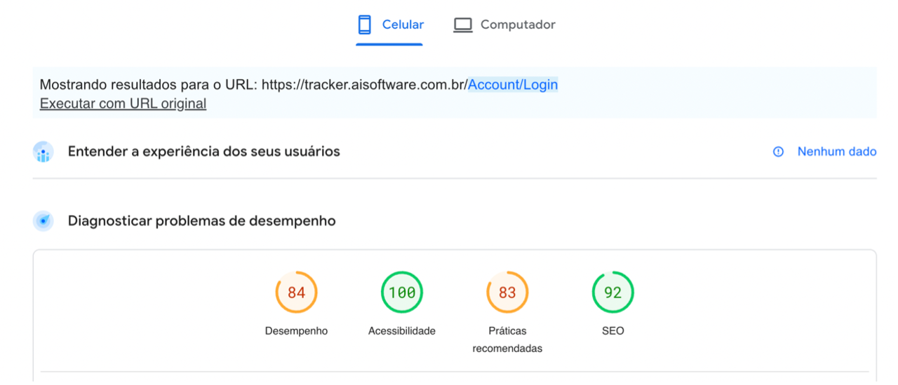 |
| **Consideração sobre a arquitetura:** |  |
| **Riscos:** | Dispositivos onde a biblioteca do Bootstrap eventualmente não consiga manter a responsividade por falta de mapeamento. |
| **Pontos de Sensibilidade:** | A incapacidade de testar em todos os tipos e resoluções de telas existentes no mercado. |
| **Tradeoff:** | Custo de testes de layouts em uma grande quantidade de dispositivos do mercado. |

#### Cenários 4 e 5

| **Atributo de Qualidade:**  | Confiabilidade             |
| --------------------------- | ------------------------------------------------------------ |
| **Requisito de Qualidade:** | O tempo de resposta das requisições deve ser inferior a 2 segundos em 90% do tempo.
O Sistema deve suportar picos de acesso, escalando automaticamente e alocando mais Dynos (Pods) caso necessário |
| **Preocupação:** | Garantir que o sistema tenha um tempo de resposta e load menor ou igual a 2 segundos em requisições e navegações comuns. E o sistema deve suportar picos de acessos. |
| **Cenários(s):** | Cenários 4 e 5 |
| **Ambiente:** | Navegações e requisições das páginas |
| **Estímulo:** | Loads de telas e requisições HTTP. |
| **Mecanismo:** | Utilização de métricas do browser (Chrome) e o Page Speed Insights do Google, e o Heroku Metrics |
| **Medida de Resposta:** | O tempo de resposta e load da tela igual ou inferior a 2 segundos. E alteração na quantidade de Dynos instanciados.  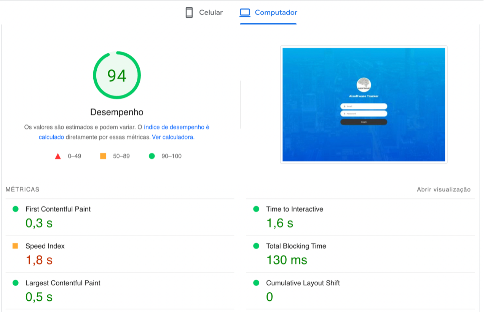
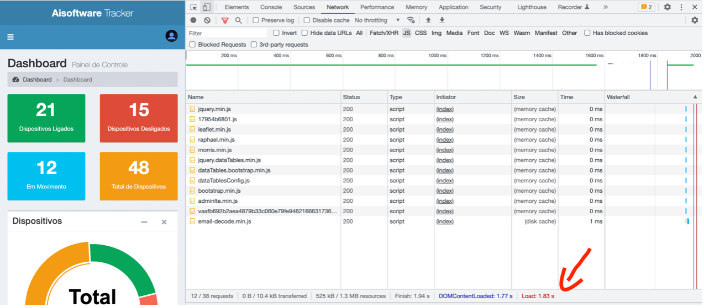
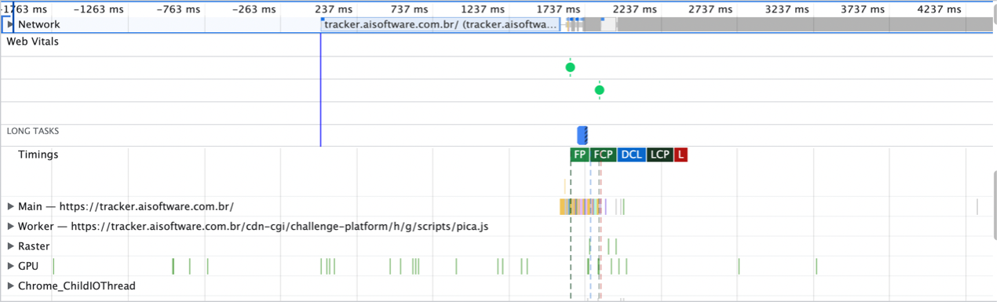
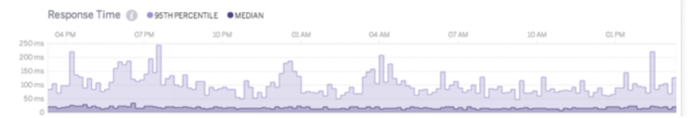
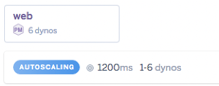 |
| **Consideração sobre a arquitetura:** |  |
| **Riscos:** | Alguma instabilidade ou indisponibilidade de um fornecedor terceiro pode interferir no tempo de resposta ou disponibillidade de recursos da aplicação. |
| **Pontos de Sensibilidade:** | Utilização de API de terceiro para alguns recursos. |
| **Tradeoff:** | Custo de internalizar os recursos que a API do terceiro fornece. Custo de Pods adicionais. |

#### Cenário 6

| **Atributo de Qualidade:**  | Confiabilidade             |
| --------------------------- | ------------------------------------------------------------ |
| **Requisito de Qualidade:** | O sistema deve exigir autenticação para navegar no mesmo e autorização para acessar determinados tipos de acessos restritos a diferentes perfis |
| **Preocupação:** | Que usuários sem as devidas permissões realizem atividades dentro do sistema as quais os mesmos não tenham permissão. |
| **Cenários(s):** | Cenário 6 |
| **Ambiente:** | Sistema em operação normal |
| **Estímulo:** | Acesso a telas e recursos específicos aos quais necessitam de permissão para tipo específico de usuário  |
| **Mecanismo:** | Controle de acesso de usuário por Roles e ClaimIdentity no token JWT. |
| **Medida de Resposta:** | O Sistema deve permitir ou não acessar determinados recursos de acordo com a autenticação e/ou autorização que o usuário detém.   
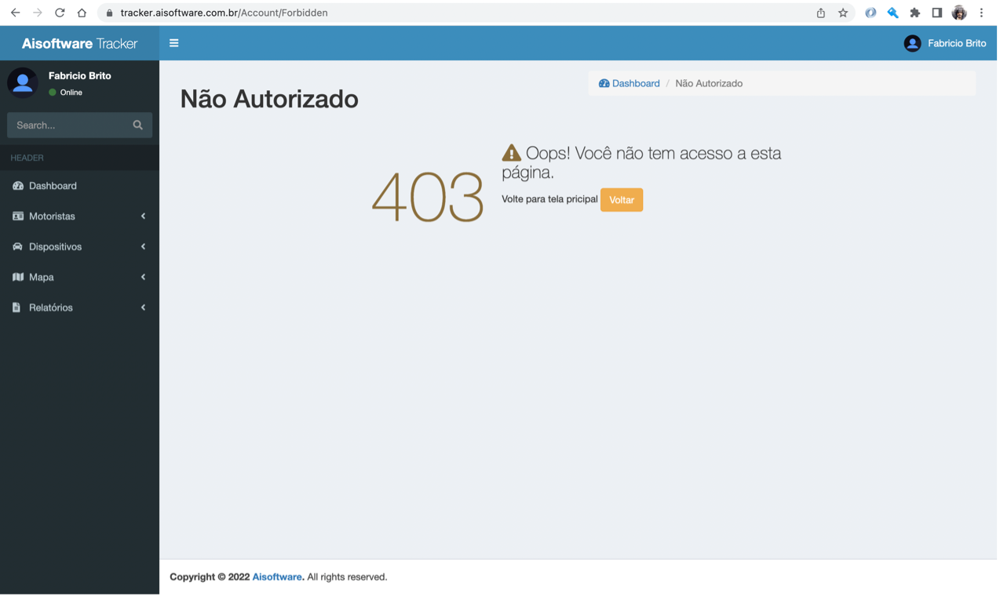
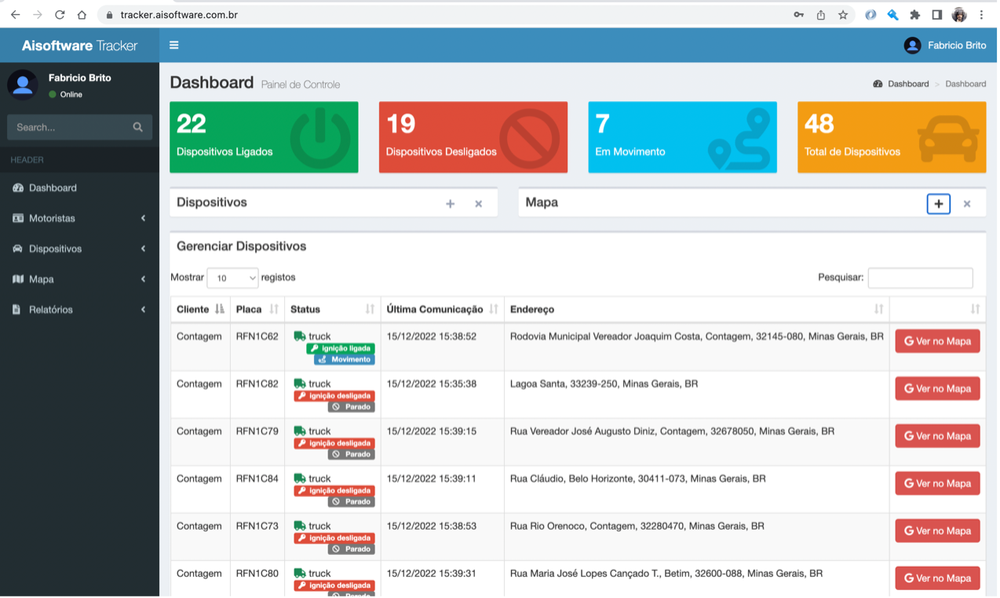
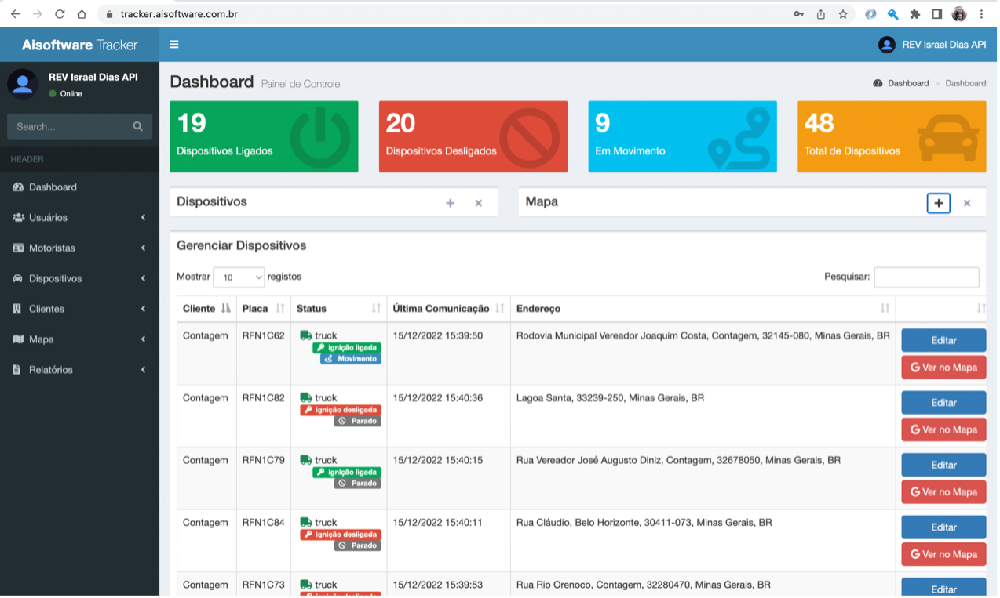 |
| **Consideração sobre a arquitetura:** |  |
| **Riscos:** | A área de segurança sempre possui um nível de risco crítico, qualquer vulnerabilidade pode comprometer a aplicação. |
| **Pontos de Sensibilidade:** | Todas as requisições externas para a aplicação devem possuir certificado HTTPS. |
| **Tradeoff:** | N/A |

### Resultados obtidos

Após a avaliação dos critérios de qualidade propostos, foi constatado que o objetivo foi alcançado. Os resultados obtidos para os atributos de disponibilidade, usabilidade, desempenho, rastreabilidade, segurança e acessibilidade estão apresentados em uma tabela a seguir:

| **Requisitos Não Funcionais** | **Teste** | **Homologação** |
| ------------- | --------- | --------------- |
| RNF01: A plataforma deve habilitar a autenticação baseado no modelo JWT diretamente no sistema | OK | Ok |
| RNF02: O sistema deve ser responsivo web                     | OK | Ok |
| RNF03: O sistema deve ser responsivo para todos os tipos de tela (Computadores, Notebooks, Tablets e Smartphones).               | OK | Ok |
| RNF04: O sistema deverá utilizar uma API de terceiro para realizar as persistências de informações dos dispositivos rastreadores | OK | Ok |
| RNF05: O sistema deverá utilizar uma API de terceiro para realizar as persistências de informações dos dispositivos rastreadores | OK | Ok |
| RNF06: O sistema deve operar 24x7                            | OK | Ok |
| RNF07: Apenas usuários com permissão de Admin, tem permissão de criar e editar dados do sistema                                  | OK | Ok |
| RNF08: Usuários operacionais, podem apenas acessar dados de leitura.                           | OK | Ok |

### Avaliação crítica dos resultados

Após avaliar todos os aspectos arquitetônicos deste projeto, dois se destacam como os mais importantes: segurança e facilidade de uso. Levando em conta esses critérios e o orçamento disponível, a arquitetura proposta atende adequadamente aos requisitos estabelecidos.

A decisão de construir a interface gráfica com ASPNET Core 6.0 trouxe uma grande vantagem a nível de desenvolvimento, por não trazer muita complexidade de implementação e toda robustez e segurança da linguagem (C#) e facilidades que o framework traz. Com módulos de independentes por se utilizar o MVC do e outras decisões de segregação de responsabilidades tomadas durante a construção do projeto.

Com isto a decisão trouxe uma facilidade para implementar a segurança de acesso, autenticação e autorização, por ter libs simples de se implementar o JWT e bastante material e documentação.

A abordagem de camadas também permite futuramente trocar a camada de apresentação para outra tecnologia, como o React, Angular e outras libs e frameworks de front-end.

O uso de bibliotecas como Bootstrap para desenvolver os layouts também se mostrou assertiva, por ter vários recursos e classes nativos à biblioteca que deixaram o design limpo, simples e de fácil utilização.

A utilização de uma plataforma PaaS como o Heroku, removeu toda complexidade de infraestrutura, como a criação de estrutura de CI/CD, Builds, configuração de métricas, alertas e configurações de distribuição DNS e etc. Trazendo com insto uma maior velocidade no desenvolvimento e publicação da aplicação.

 

### Conclusão

É possível afirmar que este projeto foi bem-sucedido, mostrando a possibilidade de criar uma plataforma de conexão entre os participantes dos programas de doação de cestas básicas.

A realização da prova de conceito foi essencial para entender o efeito que a priorização da segurança teria sobre o desempenho do sistema e determinar quais elementos de um software seguro poderiam ser implementados sem prejudicar a facilidade de uso. Foi possível descobrir que não é possível criar um sistema que satisfaça todas as necessidades ao mesmo tempo, exigindo que algumas sejam priorizadas em detrimento de outras.

Foi possível notar que aumentar a complexidade do sistema, usando um modelo de microserviços, pode ter um efeito negativo na manutenção, especialmente se as fronteiras entre os serviços não estiverem bem definidas.

Um ponto importante da arquitetura proposta foi a possibilidade de reproduzir o ambiente de produção em um computador com recursos limitados. Esta decisão foi tomada com base na escolha de usar ferramentas de código aberto que não estão ligadas a um provedor de serviços de nuvem. O sistema tornou-se mais manutenível, pois foi possível testar ideias e questões durante o processo de criação, sem precisar configurar recursos de infraestrutura.

Uma equipe distribuída poderia executar este projeto de forma que ele fosse criado sob uma licença de código aberto.
Futuras expansões do projeto devem ser adotados APIs com BFF e a internalização de processos os quais são oferecidos por meio de terceiros.

Além disso, podem ampliar a variedade de interfaces visuais disponíveis criando aplicativos nativos para melhorar a eficiência e a facilidade de uso em dispositivos móveis.

### Vídeo de apresentação final

[ Vídeo com apresentação da Etapa 03](https://www.youtube.com/watch?v=S8E-yXqiqwI)
